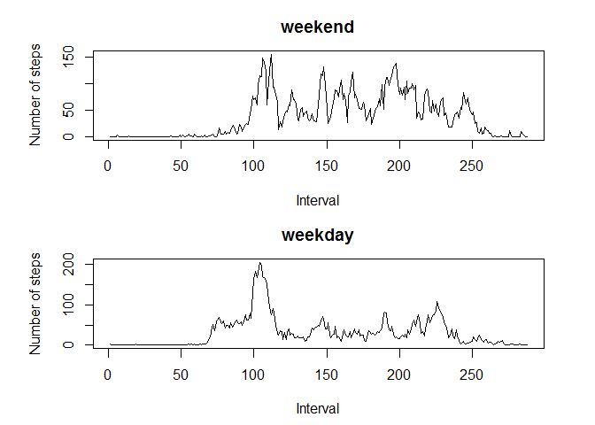

# Reproducible Research: Peer Assessment 1


```
## [1] "English_United States.1252"
```
## Loading and preprocessing the data
1. Load the data

The dataset was loaded and named 'amd'.

2. Process/transform the data (if necessary) into a format suitable for your analysis

```r
amd$date = as.Date(amd$date)
amd1 = amd[complete.cases(amd),]
```

## What is mean total number of steps taken per day?
1. Calculate the total number of steps taken per day

```r
sum_step_date = tapply(amd1$steps,amd1$date,sum)
```

2. Make a histogram of the total number of steps taken each day

```r
hist(sum_step_date, main = "Total steps taken each day",xlab = "Total number of steps")
```

 

3. Calculate and report the mean and median of the total number of steps taken per day

```r
mean_step_date = mean(amd1$steps,na.rm=T)
mdn_step_date = median(amd1$steps,na.rm=T)
```
The mean number of steps per day is 37.3825996.
The median number of steps per day is 0.

## What is the average daily activity pattern?
1. Make a time series plot of the 5-minute interval (x-axis) and the average number of steps taken, averaged across all days (y-axis)

```r
sum_step_int = tapply(amd1$steps,amd1$interval,sum)
plot(sum_step_int,type="l", main = "Average steps taken by interval",xlab = "5-minute interval",ylab = "Average number of steps")
```

 

2. Which 5-minute interval, on average across all the days in the dataset, contains the maximum number of steps?

```r
max_step = names(which.max(sum_step_int))
```
The maximum number of steps per 5-minute interval occured at interval 835

## Imputing missing values
1. Calculate and report the total number of missing values in the dataset

```r
missing = length(which(complete.cases(amd)==FALSE))
```
The total number of missing values in the dataset is 2304.

2. Devise a strategy for filling in all of the missing values in the dataset.
3. Create a new dataset that is equal to the original dataset but with the missing data filled in.

```r
mdn_step_int =tapply(amd1$steps,amd1$interval,median,na.rm=T)
amd2 = amd
amd2[is.na(amd$steps),"steps"] = mdn_step_int[as.character(amd2[is.na(amd2$steps),"interval"])]
```
Missing/NA values were imputed by the median for its 5-minute interval.

4. Make a histogram of the total number of steps taken each day and Calculate and report the mean and median total number of steps taken per day. Do these values differ from the estimates from the first part of the assignment? What is the impact of imputing missing data on the estimates of the total daily number of steps?
 

The mean number of steps per day for the imputed dataset is 32.9995446.
The median number of steps per day for the imputed dataset is 0.
The mean of steps per day for the imputed dataset is smaller than that of the original while the median of steps per day remained the same. The decrease in mean number of steps was resulted from multiple 0s introduced during the imputation process.

## Are there differences in activity patterns between weekdays and weekends?
1. Create a new factor variable in the dataset with two levels: weekdays indicating whether a given date is a weekday or weekend day.

```r
date_wk = weekdays(amd2$date)
date_wk[date_wk=="Saturday"|date_wk=="Sunday"]="weekend"
date_wk[date_wk!="weekend"]="weekday"
date_wk = as.factor(date_wk)
amd3 = cbind(amd2,date_wk)
```

2. Make a panel plot containing a time series plot of the 5-minute interval (x-axis) and the average number of steps taken, averaged across all weekday days or weekend days (y-axis).

```r
amd3_e = amd3[amd3$date_wk=="weekend",]
amd3_d = amd3[amd3$date_wk=="weekday",]
mean_step_int_e = tapply(amd3_e$steps,amd3_e$interval,mean)
mean_step_int_d = tapply(amd3_d$steps,amd3_d$interval,mean)
par(mfrow = c(2,1),oma=c(0.5,0.5,0,0),mar=c(4,5,3,3))
{
    plot(mean_step_int_e,type = "l",main = "weekend",xlab = "Interval",ylab = "Number of steps")
    plot(mean_step_int_d,type = "l",main = "weekday",xlab = "Interval",ylab = "Number of steps")
}
```

 
